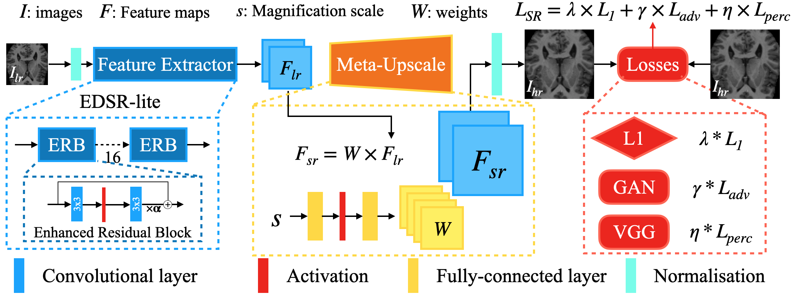
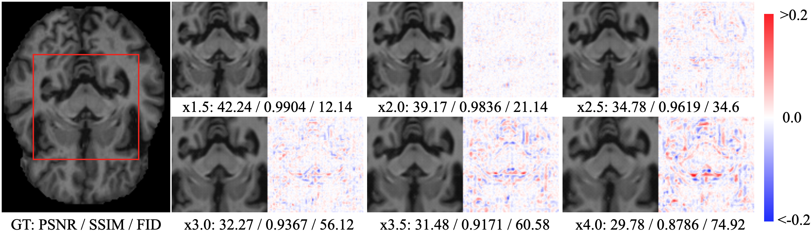
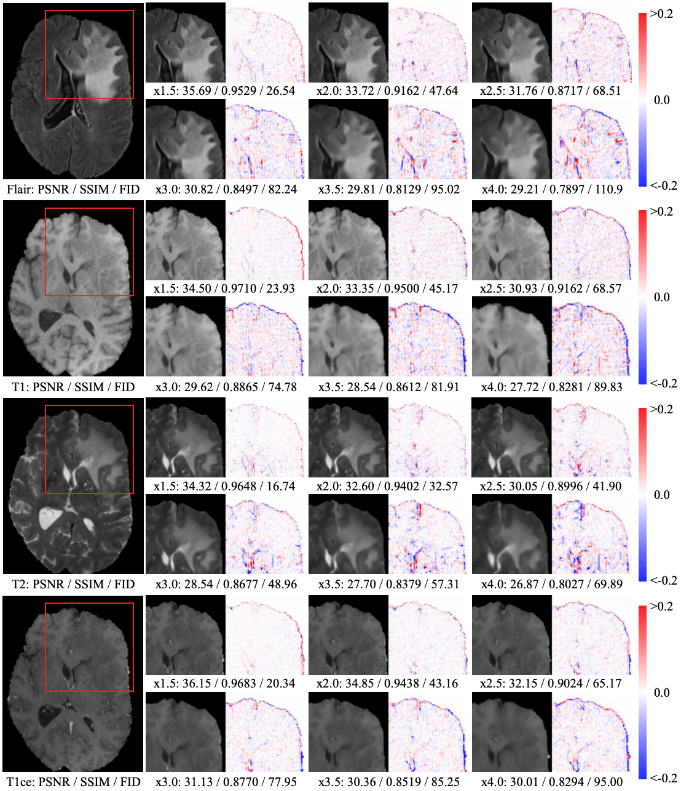
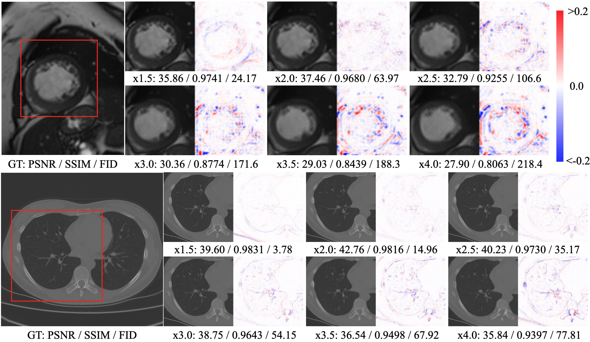
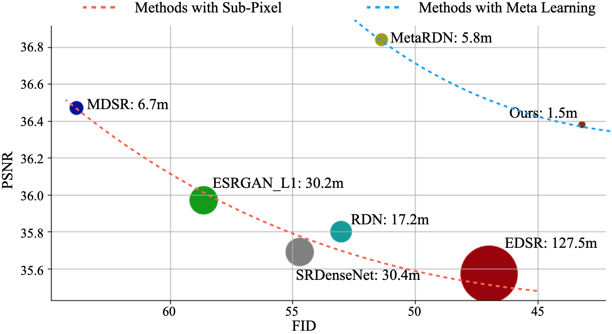

# MIASSR
An Approach for Medical Image Arbitrary Scale Super-Resolution

## Introduction
Single image super-resolution (SISR) aims to obtain a high-resolution output from one low-resolution image.  Currently, deep learning-based SISR approaches have been widely discussed in medical image processing, because of their potential to achieve high-quality, high spatial resolution images without the cost of additional scans. However, most existing methods are designed for scale-specific SR tasks and are unable to generalise over magnification scales. In this paper, we propose an approach for medical image arbitrary-scale super-resolution (MIASSR), in which we couple meta-learning with generative adversarial networks (GANs) to super-resolve medical images at any scale of magnification in $(1, 4]$. Compared to state-of-the-art SISR algorithms on single-modal magnetic resonance (MR) brain images (OASIS-brains) and multi-modal MR brain images (BraTS), MIASSR achieves comparable fidelity performance and the best perceptual quality with the smallest model size. We also employ transfer learning to enable MIASSR to tackle SR tasks of new medical modalities, such as cardiac MR images (ACDC) and chest computed tomography images (COVID-CT). The source code of our work is also public. Thus, MIASSR has the potential to become a new foundational pre-/post-processing step in clinical image analysis tasks such as reconstruction, image quality enhancement, and segmentation.


> Framework of MIASSR.

## Results
### Broad applicability on medical images
[OASIS](https://www.oasis-brains.org/)

[BraTS](https://www.med.upenn.edu/cbica/brats2020/data.html)

[ACDC](https://www.creatis.insa-lyon.fr/Challenge/acdc/databases.html) and COVID-CT


### Comparing with SOTA methods (PSNR + FID)



## Train & Test
To setup:
```bash
git clone https://github.com/GinZhu/MIASSR.git
cd MIASSR
pip install -r requirements.txt
```
To train:
```bash
python -W ignore train.py --config-file config_files/
```
To test:
```bash
python -W ignore test.py --config-file config_files/
```

## Pre-trained models
Here we provide pre-trained models to download (on the OASIS dataset):


## Publications & citations
This work is available at [IJNS](https://www.worldscientific.com/doi/10.1142/S0129065721500374), please cite as:
```
@article{zhu2021miassr,
  title={Arbitrary scale super-resolution for medical images},
  author={Zhu, Jin and Tan, Chuan and Yang, Junwei and Yang, Guang and Lio’, Pietro},
  journal={International Journal of Neural Systems},
  volume={31},
  number={10},
  pages={2150037},
  year={2021},
  publisher={World Scientific}
}
```
We refer to the previous works for better understanding of this project:
- Lesion focused multi-scale GAN: [paper1](https://arxiv.org/abs/1810.06693), [paper2](https://arxiv.org/abs/1901.03419), [code](https://github.com/GinZhu/msgan)